<h1 align="center">BIA - Bot Inteligente Acadêmico</h1>

<div align="center">


</div>

## Sumário

* [Integrantes](#integrantes)
* [Descrição](#descrição)
* [Requisitos](#requisitos)
* [Tecnologias](#tecnologias)
* [Fluxo do Software](#fluxo-do-software)
* [Dificuldades](#dificuldades)
* [Resultados](#resultados)
* [Como_Usar](#como_usar)
* [Conclusão](#conclusao)

## Integrantes

- Anderson do Vale - [and3510](https://github.com/and3510) 
- Beatriz Barreto - [whosbea](https://github.com/whosbea)
- Cristovam Paulo - [cristovam10000](https://github.com/cristovam10000)
- Guilherme de Assis - [onizuka465](https://github.com/onizuka465)
- Gustavo do Vale - [gustavodovale](https://github.com/gustavodovale)
- Lucas Cesar - [lucascesar1107](https://github.com/lucascesar1107)

## Descrição

Chatbot universitário que ajuda os alunos a acessarem informações de forma rápida e precisa

## Requisitos
 
- [x] Ser **aplicado no Whatsapp** - Não Funcional
- [x] Ter uma função para **mandar Calendario Acadêmico** - Funcional
- [x] Ter uma função para **mostrar horarios das provas** - Funcional
- [x] Ter uma função para **mostrar as faltas do aluno** - Funcional
- [x] Ter uma função para **o usuario reportar problemas da faculdade,chatbot ou curso** - Funcional
- [x] Ter uma função para **pesquisar livros que estão na biblioteca** - Funcional
- [x] Ter uma função para **mostrar as notas das provas e quizzes do aluno** - Funcional
- [x] Ter uma função para **mostrar os números de telefone e emails da instituição** - Funcional
- [ ] Ter uma função para **começar um bate papo com uma IA, para tirar duvidas sobre as materias** - Funcional
- [x] Usar Banco para **armazenar e buscar informações** - Não Funcional


## Tecnologias

- **Typebot**: Plataforma para criar chatbots interativos, sem programação complexa.
- **NocoDB**: Banco de dados visual que transforma dados em planilhas.
- **Evolution API**: Automação para envio de mensagens via WhatsApp.
- **WhatsApp**: Plataforma para troca de mensagens e comunicação instantânea.
- **ChatGPT**: IA para geração de conversas em linguagem natural.
- **Docker**: Virtualização de aplicações em contêineres para qualquer ambiente.
- **Postman**: Ferramenta para testar, monitorar e documentar APIs.


## Fluxo do Software

<div align="center">
  
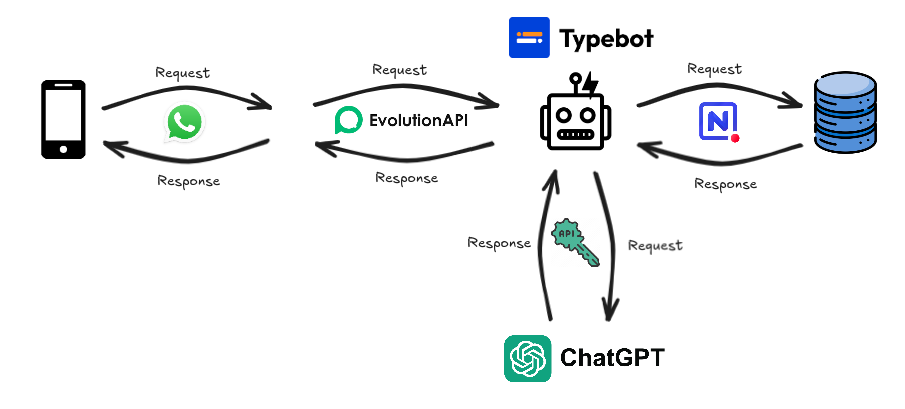

</div>


## Dificuldades

Realizar pesquisas acadêmicas com os alunos é desafiador devido à baixa participação, causada por falta de tempo ou desinteresse no tema. A sobrecarga de atividades acadêmicas e extracurriculares dificulta o comprometimento dos estudantes, afetando a qualidade e quantidade das respostas.

Tivemos problemas durante a execução dos testes do protótipo devido ao grande número de solicitações, o que causou algumas sobrecargas e paralisações nos testes.

Além disso, gastamos um tempo tentando enviar uma requisição HTTP da plataforma **Typebot** para a **API Evolution**.Felizmente, conseguimos ter sucesso após expor o serviço local à internet usando o comando `ngrok` no Linux.

Durante o projeto, fomos informados de que não poderíamos integrar o chatbot com o banco de dados da faculdade por questões de segurança. Isso reduziu as chances de o sistema ser adotado pela instituição, porém, poderíamos ajustar o projeto removendo as funcionalidades que dependiam de acesso ao banco de dados da faculdade, como **Ver Notas**, **Faltas** e **Biblioteca**.

Devido ao alto custo das requisições, não conseguimos utilizar a API do ChatGPT, então optamos por usar a API Gemini.


## Resultados

### Fluxo do Typebot

<div align="center">


**Fluxo de criação do bot na plataforma Typebot**

</div>

### Plataforma de Gerenciamento

<div align="center">

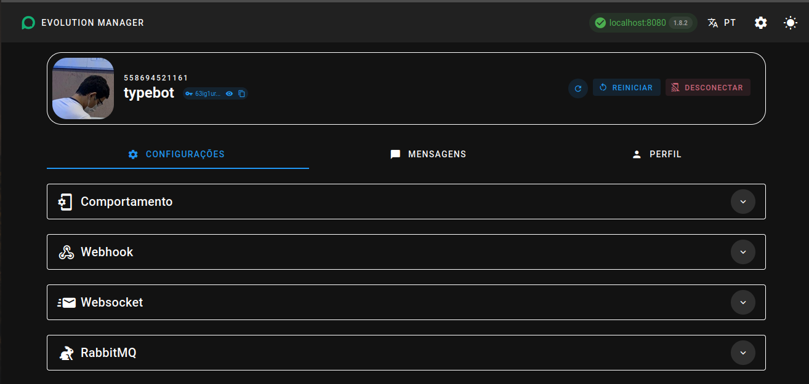

**Plataforma para gerenciar as funcionalidades do bot, executado em contêiner**

</div>

### Tabelas do Banco de Dados


<div align="center">
  
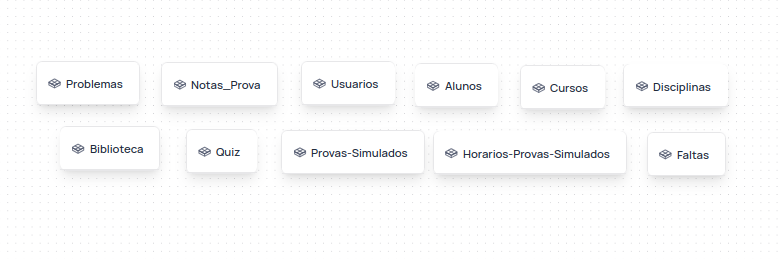

</div>

<br>

- A criação de personagens e dados fictícios foi realizada para testes com o chatbot e o banco de dados.
- Sete salas foram criadas, cada uma abrigando um personagem específico.
- O cursos criados foram 3 (Engenharia Software, Direito, Administração) com periodos diferentes e turnos.

### Menu Principal de Botões

<div style="text-align: center; margin-top: 20px;">
    <table border="0" cellspacing="0" cellpadding="0" style="margin: auto;">
        <tr>
            <td style="border: 0; width: 800px; vertical-align: top; padding-top: 20px;">
                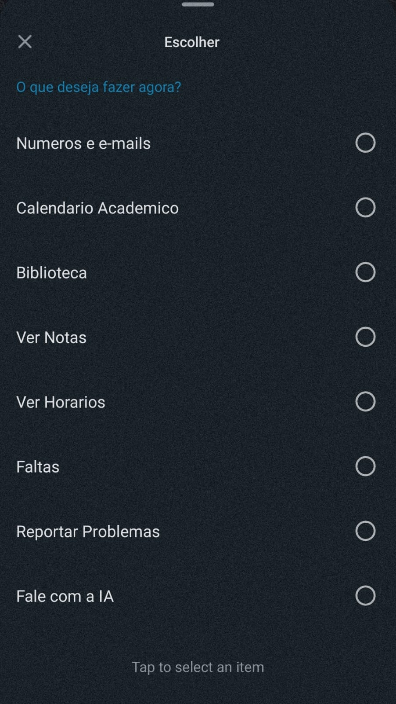
            </td>
            <td style="vertical-align: top; padding-top: 20px;">
                A implementação de um menu interativo é essencial para melhorar a experiência do usuário em aplicativos e plataformas. Neste contexto, a API Evolution fornece uma maneira eficiente de criar menus dinâmicos e personalizáveis. Neste artigo, vamos explorar como desenvolver um menu com 8 botões utilizando a sendList da API Evolution.
            </td>
        </tr>
    </table>
</div>


### Feedback para o chatbot

<div align="center">

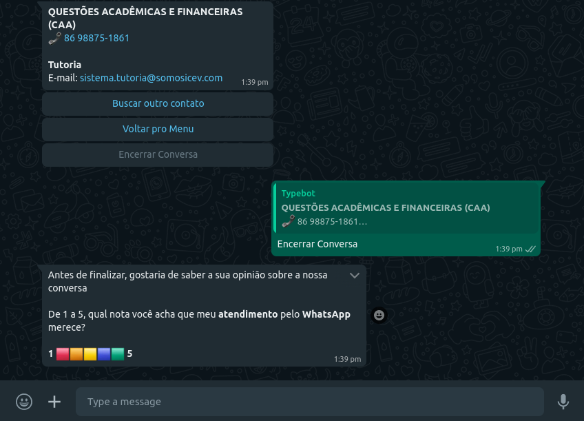

**Aviso de feedback, após os usuarios encerrarem a conversa com o bot**

</div>


## Como_Usar

> Antes de tentar usar, é importante ja saber como usar as plataformas [**Typebot**](https://docs.typebot.io/get-started/introduction) e [**NocoDb**](https://docs.nocodb.com/)

### 1° Etapa (Criação de contas e configuração)

1. **Criar Conta no Typebot:**

   - Acesse o site do Typebot e siga as instruções para criar uma conta. 

2. **Criar Conta no NocoDB:**

   - Acesse o site do NocoDB e registre-se para criar sua conta.

3. **Integração entre Typebot e NocoDB:**

   O Typebot oferece suporte direto para o NocoDB, facilitando a integração. Para configurar, siga os passos abaixo:

   - **Token de Autenticação:** 
     - Você precisará fornecer o token da API do NocoDB para autenticar a conexão.

   - **IDs das Tabelas:** 
     - Quando solicitado pela integração, especifique os **Table IDs** das tabelas que deseja acessar.

4. **Carregamento das Tabelas:**

   - As tabelas estão disponíveis no arquivo `tables.zip`. Baixe o arquivo e faça o upload de cada tabela no NocoDB.

5. **Importar o Template:**

   - Utilize meu arquivo `template.json` para importar as configurações necessárias para o Typebot.


<div align="center">

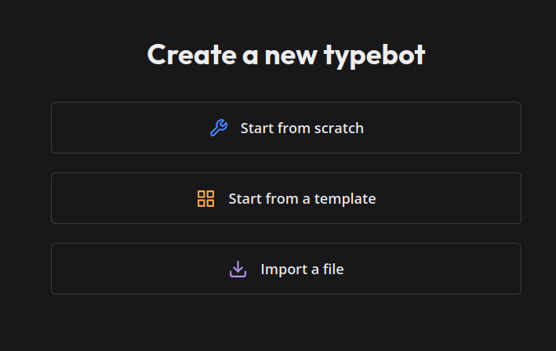


</div>


### 2ª Etapa: Criando um Contêiner para Rodar a Evolution API

1. **Navegue até o diretório do arquivo `docker-compose.yml`:**
> Estarei usando a versão 1.8.2 do Evolution API
  
   Use o seguinte comando para acessar a pasta do projeto:

   ```bash
   cd BIA_Project
   ```

2. **Execute o stack com o Docker Compose:**

   Para iniciar os serviços definidos no Docker Compose, utilize o comando:

   ```bash
   docker-compose up
   ```
   Se não tiver docker, veja a [documentação](https://www.docker.com/) 

3. **Acesse a API localmente:**

   Após executar o comando acima, um contêiner chamado **evolution-whatsapp_api-1** será iniciado na porta 8080. Para verificar se a API está rodando corretamente, abra o navegador e acesse:

   ```
   https://localhost:8080
   ```

   No entanto, para que o Typebot possa fazer requisições HTTP, precisamos expor a porta 8080 para a internet.

4. **Exponha a porta com Ngrok:**

   Execute o seguinte comando para expor a porta 8080:

   ```bash
   ngrok http 8080
   ```

   Isso irá gerar uma URL pública que redireciona as requisições para sua API local. Caso nunca tenha usado o Ngrok, consulte a [documentação oficial](https://ngrok.com/docs/) para mais informações.


   <div align="center">

    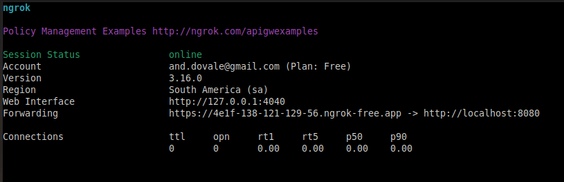


  </div>

5. **Acesse a API pela internet:**

   Como mostrado na imagem, copie a URL gerada pelo Ngrok (por exemplo, `https://4e1f-138-121-129-56.ngrok-free.app`) e cole no navegador. Agora, sua Evolution API está acessível pela internet!

   lembrando, que sua url será diferente.

--- 


### 3ª Etapa: Configurando o Typebot na Evolution API

1. **Acessar o Gerenciador:**

   - Abra o navegador e acesse o gerenciador da API por meio da URL gerada pelo Ngrok:

     ```
     https://4e1f-138-121-129-56.ngrok-free.app/manager
     ```

   - Você verá um formulário de login semelhante ao da imagem abaixo:

    <div align="center">

    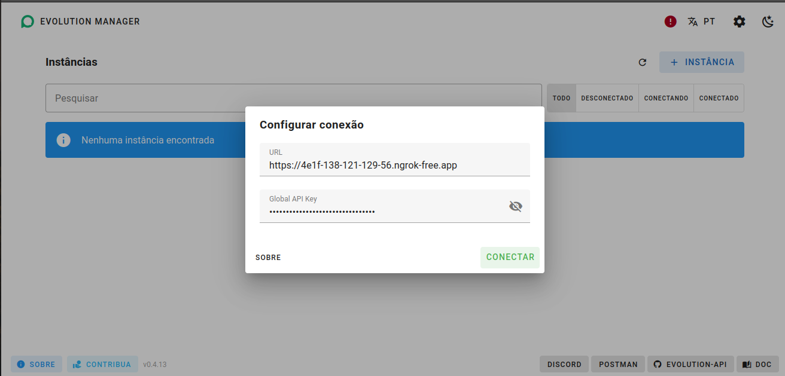


    </div>

   - O `ApiKey` padrão do Gerenciador é **4D2883EC3249AD0271123319BB6E7ABD**. Caso queira alterar, edite o arquivo `docker-compose.yml`.

    <div align="center">

    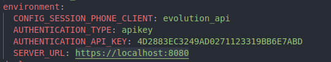


    </div>
  

2. **Conectar seu WhatsApp à Evolution API:**

   - Primeiro, será necessário criar uma **instância** para conectar o WhatsApp.

    <div align="center">

    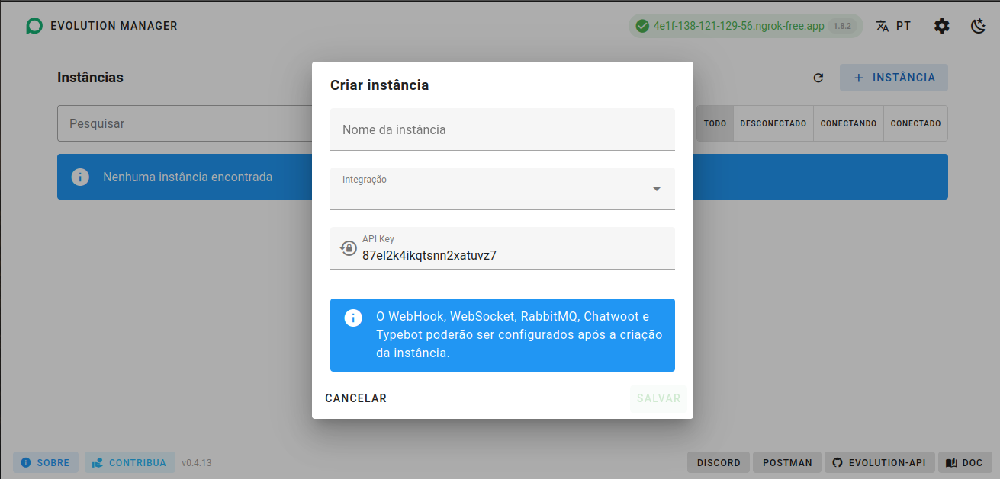


    </div>

   - Escolha o tipo de integração: **Cloud API** ou **Baileys**.  
     **Dica:** Utilize Baileys se você não estiver usando o WhatsApp Business.

   - Após criar a instância, clique nela para acessar a configuração da Evolution API.


    <div align="center">

    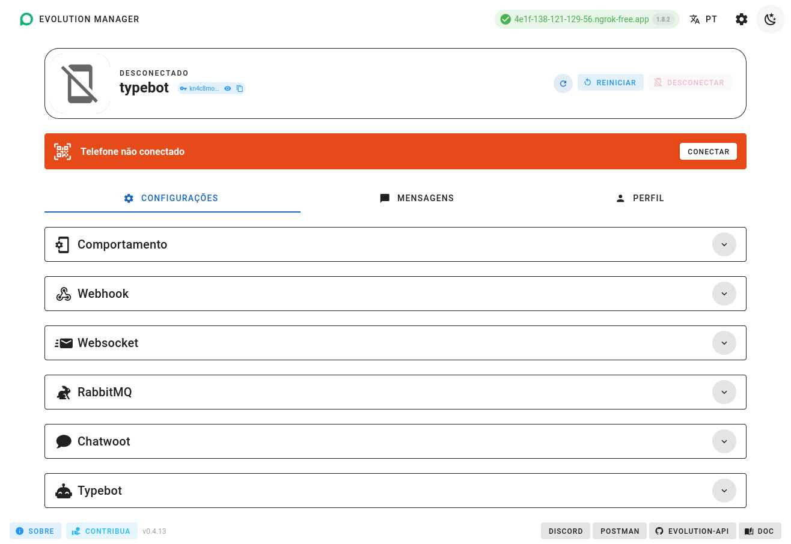


    </div>

    - Agora conecte seu whatsapp com o API, usando Scan QRCODE do aplicativo.


    <div align="center">

    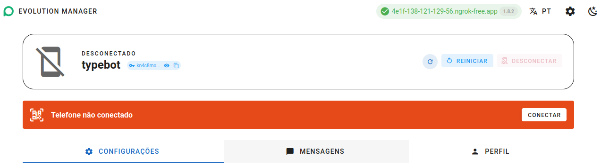


    </div>

3. **Configurar o Typebot:**

   - Dentro da instância da Evolution API, vá até a seção de configuração do **Typebot**.

   - No início do fluxo, existem três variáveis que precisam ser preenchidas:

    <div align="center">

    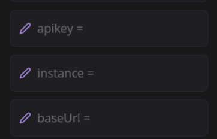


    </div>

     - **apikey**: A chave de API que você está utilizando.
     - **instance**: A instância que você criou anteriormente.
     - **baseUrl**: A URL base da API (gerada pelo Ngrok).

   - Agora, vamos configurar a API para receber corretamente o fluxo do Typebot. Para isso, o fluxo precisa estar **publicado**.

    <div align="center">

    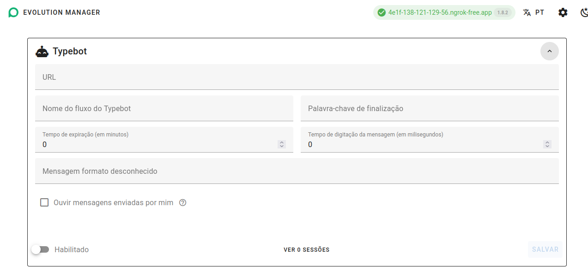


    </div>

   - Na configuração da API, utilize a URL:

     ```
     https://typebot.co
     ```

     E no campo **Nome do Fluxo**, insira o nome do fluxo correspondente, por exemplo: `"bia-1xxte5n"`.

    
    <div align="center">

    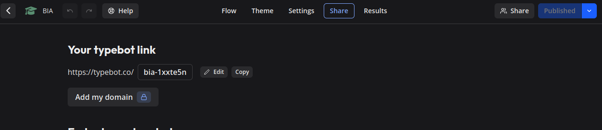


    </div>

---


Depois disso, envie uma mensagem para o número registrado na API e veja a mágica acontecer!

### Resumo dos Requisitos Necessários:

1. Tabelas: Todas as tabelas criadas e configuradas no fluxo, com os IDs das tabelas corretos.
2. API Evolution: API Evolution em execução no Docker, com a porta 8080 exposta na internet através do Ngrok.
3. Configuração de Parâmetros: Parâmetros adequadamente configurados no fluxo e na API Evolution para garantir que as requisições sejam processadas corretamente.


## Conclusão

O projeto BIA - Bot Inteligente Acadêmico é uma ferramenta inovadora que visa facilitar o acesso dos alunos às informações acadêmicas por meio de um chatbot no WhatsApp. Ele integra diversas tecnologias como Typebot, NocoDB e Evolution API, utilizando contêineres Docker para simplificar o ambiente de desenvolvimento. Através de funcionalidades como o envio do calendário acadêmico, horários de provas, notas e faltas, o bot melhora a comunicação entre a faculdade e os alunos.

Apesar das dificuldades enfrentadas, como limitações no uso de bancos de dados institucionais e sobrecarga nos testes, a equipe conseguiu implementar soluções alternativas, expondo serviços locais à internet via Ngrok, garantindo assim a continuidade do projeto. O uso de plataformas como o Typebot e a Evolution API possibilitou a criação de menus dinâmicos e personalizáveis, proporcionando uma experiência de usuário aprimorada.

No final, não obtivemos a aprovação da faculdade para implementar o projeto devido ao corte de funcionalidades, mas disponibilizaremos o protótipo publicamente para que quem quiser possa testar o software em sua máquina.

A conclusão deste projeto destaca a importância da integração entre tecnologias e a criatividade da equipe para superar os desafios, com um protótipo funcional, mesmo que com algumas funcionalidades ainda em desenvolvimento ou ajustáveis conforme as necessidades.


